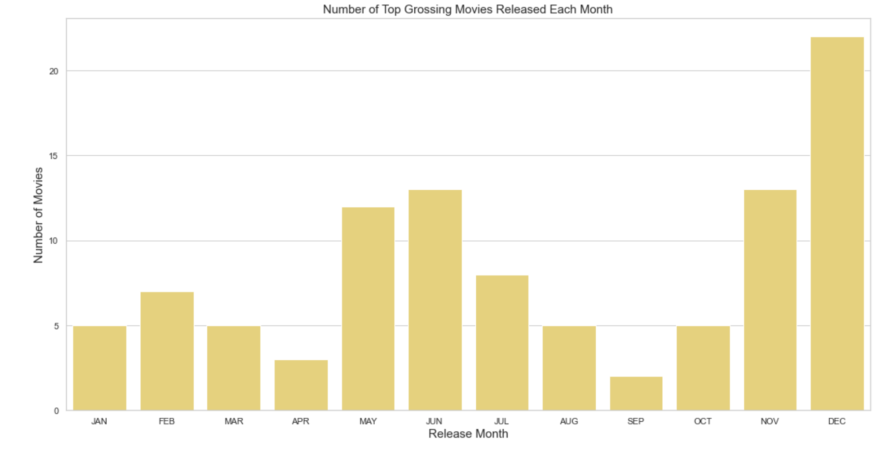

# Film Investment Analysis

This project was completed as the final Phase 2 assessment in the Flatiron School’s Data Science Bootcamp. 

Analysis by Erin Wasserman, February 2024


# Overview

This project analyzes which types of movies generate the most revenue at the box office. Descriptive analysis of movie data sets collected from Box Office Mojo, IMBD, Rotten Tomatoes, The Movie DB, and The Numbers, will highlight specific movie characteristics that increase ROI such as, genre selection, month of the film's release, and the length/runtime of the movie. This analysis can be used by the company to make decisions on these specific movie criteria and help the company's new movie studio operate with the lowest risk in their new business endeavor.


# Business Problem

Analyzing several movie datasets can provide valuable insights that can lead to concrete business recommendations in various aspects of the film industry. When considering characteristics of a successful movie, the movie data was analyzed to identify movies with the greatest return on investment. Based on this analysis, which is explained below, are the following three recommendations:

* **Action and/or Adventure genre movies gross higher than other genres**
* **Most successful release months are May, June, November, and December**
* **The most profitable movies are 85-125 minutes in length**


# Data Understanding

Some media databases provide public data that includes various data about historical and current films both domestically and internationally. Each database has a variety of variables some of which may match other databases. The quantity of data provided was excellent, however, the quality of these various datasets were weak.  

Overview of dataset:

   **Independent Sources:** 
   * Internet Movie Database (IMDb)
   * The Movie Database (TMDb)
   * Box Office Mojo
   * The Numbers
 
   **About:** Selected film industry data reported between 1915-2020. Due to the differences in the  independent databases, when choosing variables several considerations were made:
   * Data Relevance
   * Data Quantity
   * Data Quality
 
   **Decision-based Variables used:**
   * Profit/Profit Margin
   * Average Domestic Gross
   * Movie Runtime 
   * Movie Release Date 
   * Genre of Movie


# Methodology

This project uses descriptive analytics to report film financial performance across several variables using historical and current data. This analysis organizes and uses data from a variety of datasets to alert, explore, and report trends and insights into the potential gross earnings of new films based on genre, runtime, and release date. 

There are two main sections:
<ol>
    <li><strong>Data preparation steps include:</strong>
    </ol>
        <ul>
          <li>Import libraries
          <li>Read and clean provided data
          <li>Deal with missing values
          <li>Join datasets
        </ul>  
        </p>
           
<ol start="2">
    <li><strong>Analysis for each variable:</strong>
    </ol>
        <ul>
          <li>If possible, apply feature engineering
          <li>Visualize data
          <li>Provide conclusions and recommendations
        </ul>
        </p>

# Key Findings

## Profit and Profit Margin

* A strong, positive, linear association between profit and average domestic gross with a few outliers.
* The median profit is approximately 500 million US dollars.
* The median profit margin for a top 100 all-time grossing movie is approximately 88%.
* No correlation between budget and adjusted average domestic gross.


## Genre

* The top three all-time grossing genres are Action, Adventure, and Comedy.
* Almost 64% of the 100 top grossing movies of all time fall into the top three, all-time grossing genres of Action, Adventure, and Comedy.
* More than 50% of all movies produced are in the genre categories of Drama, Documentary, and Comedy.


## Release Date

* The most successful months are May, June, July, November, and December.
* Most movies are released on a Friday.




## Runtime

* The average runtime is 87 minutes.
* Top grossing movies run between 85-125 minutes.
* Movies that run between 85-125 minutes have a larger adjusted average domestic gross.


# Actionable Insights
<ol>
<li>Produce a movie with a runtime between 85-125 minutes.
<li>Aim for a May/June or November/December release date.
<li>Produce a movie with a genre of action or adventure. 
<li>Plan for a budget of $44-$136 million.
</ol>


# Next Steps

While providing valuable insights, the analysis acknowledges the need for further investigation to address nuances and ensure a comprehensive understanding of movie dynamics influencing financial success.
<ol>
<li>In-Depth Genre Analysis

<li>Mixed-Genre Film Exploration

<li>External Factors Impacting Release Timing

<li>Consumer Preferences and Genre Evolution

<li>Comprehensive ROI Forecasting Model
    
</ol>
These next steps aim to address identified inconsistencies, enhance the robustness of the analysis, and provide more actionable insights for the film company's decision-making processes.


# Author

Name: Erin Wasserman

GitHub: [Cellister](https://github.com/cellister)

Email address: cellister at gmail .com


# Repository Structure

* **Jupyter Notebook**

The [Jupyter Notebook](https://github.com/cellister/Film-Investment-Analysis-Project/blob/main/Film_Investment_Analysis_Notebook.ipynb) is the key deliverable and contains the details of my data strategy, methodology, data cleaning, visualizations, and actionable insights.

* **Presentation**

This 5-7 minute, non-technical [presentation](https://github.com/cellister/Film-Investment-Analysis-Project/blob/main/Report%20PDFs/film_investment_analysis_presentation.pdf) was made in [Canva](https://www.canva.com/design/DAFzlcctuzo/YpMIvURJO6cI7aveTLrNDA/edit?utm_content=DAFzlcctuzo&utm_campaign=designshare&utm_medium=link2&utm_source=sharebutton) and gives an impactful and brief overview of the key insights and recommendations. 

* **Data**

The data used in this analysis can be found in the ‘Data’ folder. Some data can be found on the [IMDb Website](https://developer.imdb.com/non-commercial-datasets/).

```

├── Photos
│   ├── genre_analysis
│   ├── notebook
│   ├── profit_analysis
│   ├── release_date_analysis
│   └── runtime_analysis
│    
├── Project PDFs
│   ├── film_investment_analysis_presentation.pdf
│   ├── film_investment_analysis_notebook.pdf
│   └── github_repository.pdf
├── .gitignore
├── Film_Investment_Analysis.ipynb
└── README.md
```
